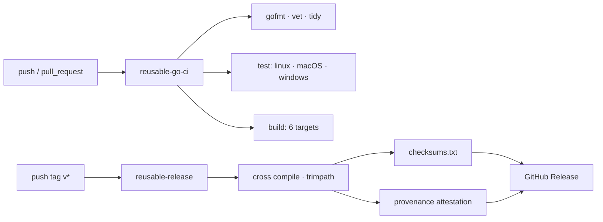

<div align="center">


<br>

**Shared project health files and reusable workflows for every GatewayIRAN repository.**

</div>

<br>

## What this repository is

GitHub treats a public repository named `.github` as the fallback for community
health files. Anything here applies automatically to every other repository in
this account that does not define its own copy — so these documents live in one
place and are edited once.

> [!NOTE]
> This is infrastructure, not a product. If you are looking for something to
> install, start at the [profile](https://github.com/GatewayIRAN).

<br>

## What it provides

| File | Applies to | Purpose |
|---|---|---|
| [CONTRIBUTING.md](CONTRIBUTING.md) | every repo | How to propose a change and get it merged |
| [CODE_OF_CONDUCT.md](CODE_OF_CONDUCT.md) | every repo | Contributor Covenant 2.1 |
| [SECURITY.md](SECURITY.md) | every repo | How to report a vulnerability privately |
| [SUPPORT.md](SUPPORT.md) | every repo | Which channel answers which question |
| [.github/ISSUE_TEMPLATE/](.github/ISSUE_TEMPLATE) | every repo | Structured bug, feature and docs forms |
| [.github/PULL_REQUEST_TEMPLATE.md](.github/PULL_REQUEST_TEMPLATE.md) | every repo | Review checklist |
| [.github/CODEOWNERS](.github/CODEOWNERS) | this repo | Automatic review assignment |
| [.github/dependabot.yml](.github/dependabot.yml) | this repo | Weekly Action updates |
| [.github/release.yml](.github/release.yml) | this repo | Release-note categories |

<br>

## Reusable workflows

Each repository calls these instead of copying a pipeline. Changing CI across
the whole account means editing one file here.



<details>
<summary><b>Continuous integration</b></summary>

<br>

```yaml
name: CI
on:
  push:
    branches: [main]
  pull_request:

permissions:
  contents: read

jobs:
  ci:
    uses: GatewayIRAN/.github/.github/workflows/reusable-go-ci.yml@main
    with:
      coverage-threshold: 70
```

Runs `gofmt`, `go vet`, a `go mod tidy` drift check, the race-enabled test suite
on Linux, macOS and Windows, and a cross-compile across six targets. The
coverage floor is optional; omit it and the gate is skipped.

</details>

<details>
<summary><b>Release</b></summary>

<br>

```yaml
name: Release
on:
  push:
    tags: ["v*"]

permissions:
  contents: read

jobs:
  release:
    uses: GatewayIRAN/.github/.github/workflows/reusable-release.yml@main
    with:
      binary-name: certway
      main-package: ./cmd/certway
      version: ${{ github.ref_name }}
```

Builds with `-trimpath` and a `SOURCE_DATE_EPOCH` taken from the tagged commit,
so the same tag produces the same bytes. Emits `checksums.txt`, attaches a
signed build-provenance attestation, and publishes the release with generated
notes.

</details>

<details>
<summary><b>Dependency review</b></summary>

<br>

```yaml
name: Dependency review
on: [pull_request]

permissions:
  contents: read

jobs:
  review:
    uses: GatewayIRAN/.github/.github/workflows/reusable-dependency-review.yml@main
```

Fails a pull request that pulls in a dependency with a known vulnerability at
`moderate` severity or above.

</details>

<br>

## Conventions these files assume

- **Apache-2.0** everywhere. One licence across all projects; a mixed licence
  set is a signal of carelessness.
- **DCO, not a CLA.** `git commit -s` is the whole requirement.
- **Conventional Commits.** Release notes are generated from the history, so the
  message format is functional, not cosmetic.
- **Actions pinned to commit SHAs**, never to floating tags. A tag can be moved;
  a SHA cannot.
- **Least-privilege tokens.** Every workflow declares `permissions:` explicitly
  and starts from `contents: read`.
- **No telemetry.** Nothing built here reports usage anywhere.

<br>

## Verifying a release

```bash
sha256sum -c checksums.txt --ignore-missing
gh attestation verify <binary> --owner GatewayIRAN
```

<br>

<div align="center">
<sub>Apache-2.0 · No trackers · Maintained by <a href="https://github.com/MrAryanMiri">@MrAryanMiri</a></sub>
</div>
